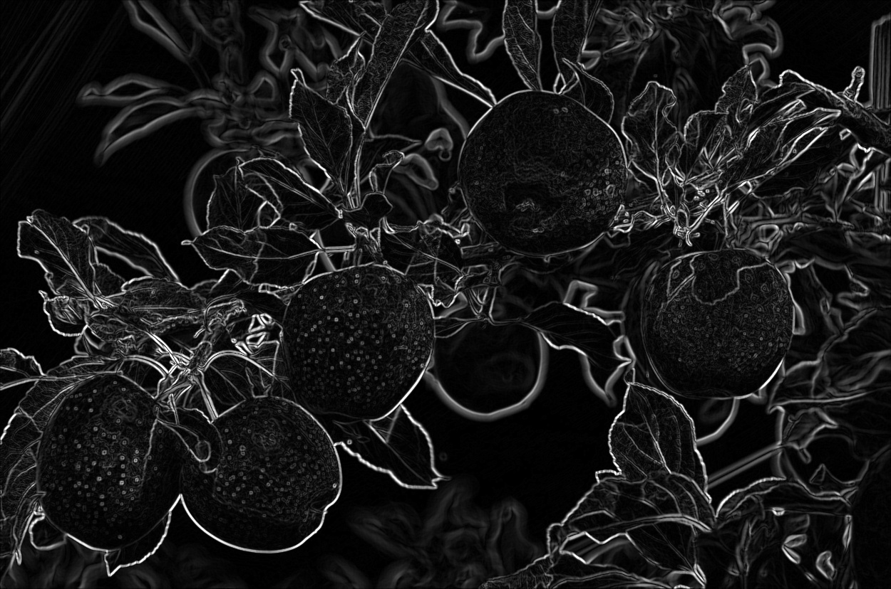

# Apple Computer Vision

## 프로젝트 개요 (Project Overview)
본 프로젝트는 OpenCV를 활용하여 사과 이미지를 분석하고, 서로 다른 에지 검출 기법(Sobel, Canny)을 비교하며 객체의 윤곽선을 추출하는 것을 목표로 합니다.  

---

## 입력 이미지 (Input Image)

---

## 이미지 처리 과정 (Processing Pipeline)

### 1. Grayscale 변환
컬러 이미지를 흑백 이미지로 변환하여 연산 복잡도를 줄이고 에지 검출 성능을 향상시킵니다.

---

### 2. Gaussian Blur
노이즈 제거 및 에지 검출 안정성을 위해 Gaussian Blur를 적용합니다.

- (3, 3): Sobel / Canny 에지 검출에 사용  
- (7, 7): Contour 검출에 사용 (더 부드러운 경계 생성)

---

## 에지 검출 (Edge Detection)

### 3. Sobel Edge Detection
Sobel 연산자를 이용하여 x, y 방향의 기울기를 계산하고 이를 결합하여 에지 강도를 구합니다.

---

### 4. Canny Edge Detection
이중 임계값을 기반으로 노이즈를 줄이면서 강한 에지를 검출합니다.

---

## 윤곽선 검출 (Contour Extraction)

### 5. Contour Detection
이진화된 에지 이미지에서 객체의 외곽선을 추출합니다.

처리 과정:
- Canny 기반 에지 맵 생성
- Morphological Closing으로 노이즈 제거 및 연결
- 작은 영역(≤ 200) 제거
- 최종 윤곽선을 원본 이미지에 표시

---

## 사용 기술 (Technologies Used)
- OpenCV (cv2)
- NumPy

---

## 결과 요약 (Summary)
- Sobel과 Canny 에지 검출 방법 비교
- 노이즈 제거 후 윤곽선 추출 구현
- 이미지 전처리의 효과 확인
