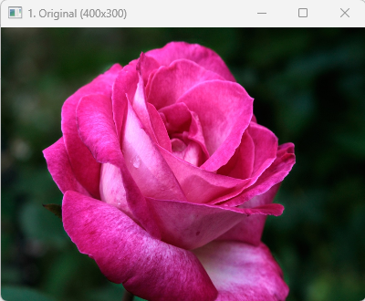

# Rose Image Processing

## Project Overview
This project implements basic geometric image processing using OpenCV.  
It focuses on resizing and rotation transformations to understand how image geometry changes through simple operations.

본 프로젝트는 OpenCV를 활용한 기본적인 기하학적 이미지 처리 프로젝트입니다.  
이미지 크기 변경 및 회전 변환을 통해 영상의 기하학적 변화를 이해하는 것을 목표로 합니다.

---

## Input Image
여기가 사진 넣는곳이야  

---

## Processing Steps (처리 과정)

### 1. Image Resizing
The original image is resized to demonstrate scaling transformation.

원본 이미지를 축소하여 스케일 변환을 확인합니다.

---

### 2. Image Rotation
The resized image is rotated using an affine transformation matrix.

Affine 변환 행렬을 이용하여 이미지를 회전합니다.
 

---

### 3. Final Output Comparison
The processed results are used to compare how image structure changes through geometric transformations.

기하학적 변환을 통해 이미지 구조가 어떻게 변화하는지 비교합니다.

 

---

## Key Concepts (핵심 개념)
- Geometric transformation (기하학적 변환)
- Image scaling (이미지 크기 변경)
- Affine transformation (아핀 변환)
- Image rotation (이미지 회전)

---

## Technologies Used
- OpenCV (cv2)
- NumPy

---

## Project Insight (프로젝트 의의)
This project demonstrates how basic geometric transformations affect digital images and provides a foundation for understanding computer vision preprocessing techniques.

본 프로젝트는 기본적인 이미지 변환이 디지털 영상에 미치는 영향을 이해하는 데 도움을 주며, 컴퓨터 비전 전처리 과정의 기초를 학습하는 데 목적이 있습니다.
